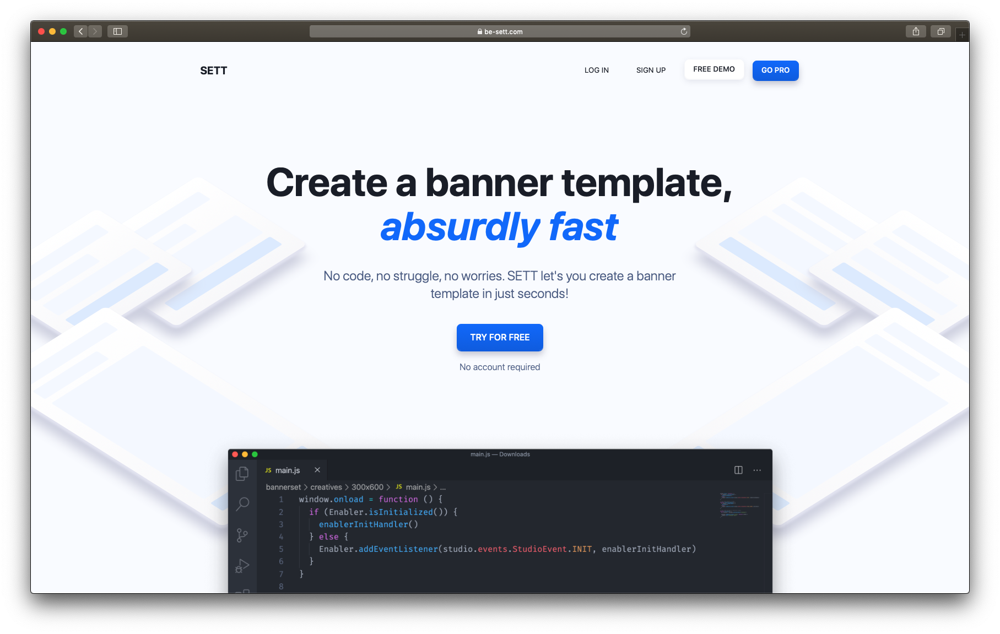

<h1 align="center"><a href="be-sett.com?ref=github">SETT</a></h1>

<a href="be-sett.com?ref=github"></a>

[](https://app.netlify.com/sites/sett-test/deploys)

Create a banner template, absurdly fast

No code, no struggle, no worries. SETT let's you create a banner template in just seconds!

If you want to create your own banner template, go check SETT out [right here!](https://be-sett.com?ref=github)

## Built With
This site is built using React, the authentication and hosting is handled using Netlify, and the payments are processed using Stripe
* [React](https://reactjs.org/)
* [Netlify](https://www.netlify.com/)
* [Stripe](https://stripe.com)

## Getting Started

To get a local copy up and running follow these simple example steps.

### Prerequisites

You'll need to have the latest version of npm and Netlify's CLI installed.
* npm
* Netlify CLI
```sh
npm install npm@latest -g
npm install netlify-cli -g
```

### Installation

1. Clone the repo
```sh
git clone https://github.com/twanmulder/sett.git
```
2. Install NPM packages
```sh
npm install
```
3. Run the app using Netlify's CLI
```sh
ntl dev
```
